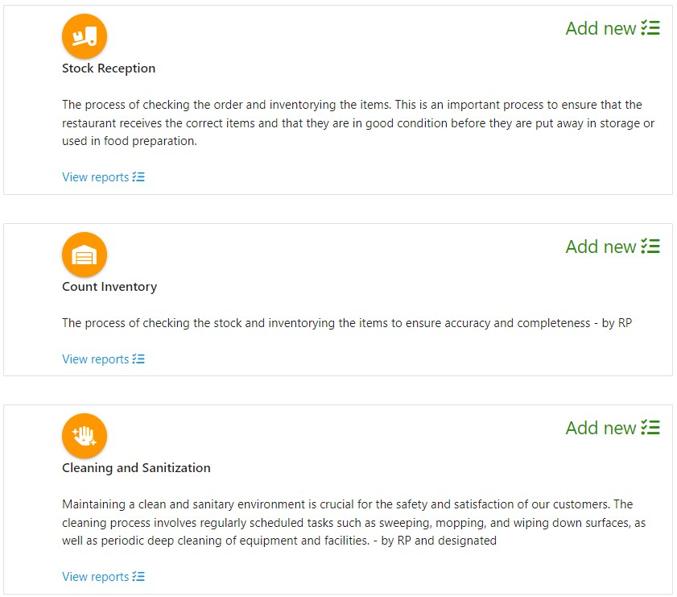
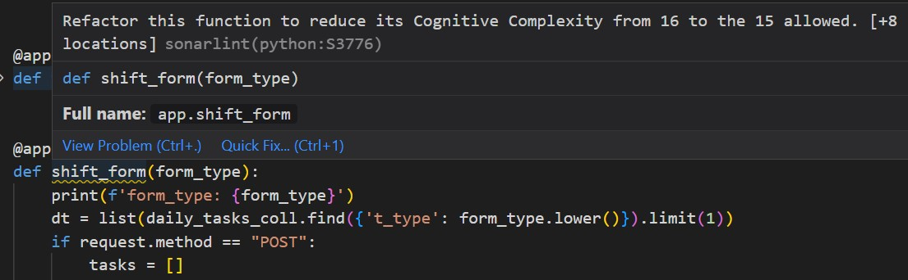

<p align="center">
  
</p>


# **Project's links**
- [Deployed project - Heroku](https://milestonemp3.herokuapp.com/)
- [GitHub Project's Repository](https://github.com/phloreenm/MP3--CI-CoBC-FM)


# **Agile methodology - Kanban**
- [KanBan style Project board](https://github.com/users/phloreenm/projects/3/views/1)
- For better organization of the project, I have used the GitHub Project Board with an Agile methodology and Kanban-style approach. The Project Board provides a visual representation of the project's progress and allows to track tasks and issues in a transparent and progressive manner.
- The board is divided into columns that represent the various stages of the project, from 'Backlog' to 'Done', and I've used cards to represent individual tasks and issues. Each card contains a brief description of the task or issue, as well as any relevant labels, description, steps and assignee.
- By using this approach, I could easily prioritize and schedule work, track progress, and identify any issues or roadblocks that needed to be addressed. This helped me to work more efficiently and effectively, and ensures that the project is moving forward smoothly and in a timely manner.


# **The idea behind 'eManager'**
- The idea of developing this web application is a result of a discussion I had with a friend of mine, about his need to use a tool to organize the flow in the activity of his restaurant. We've sketched on paper some ideas and we concluded to a simple application, for the beginning, to see how it would work in real life. Basically the app should perform as a tool both for the employees in their daily duties, but also for the managers, which could verify daily reports of the events had place during the day.

- Being a web application would allow any active employee to access it with just a smartphone, tablet or a laptop and proceed with his tasks. The access to the dashboard would be done though a login page. 

# **Features**
I designed three main levels of Role-based Access Control:
- **System Administrator**
  - 'sysadmin'(super-user):
    - Is the owner of the app providing the services to its clients (restaurant owners in our case)
    - As a backup solution, there is a special function called once at the application starting. This functions checks the database if this user exists. If not, it will be created with default credentials [hard-coded un: 'sysadmin, pw: '1111'], which may be updated at a later date.
    - This user can't be deleted.
    - Has the right to C.R.U.D.:
      - He can do 'admin' and 'manager' Users database operations
      - Can edit his details, except for the 'username' and 'role'.
  - any other 'admin' can manipulate the Users' database (admins and managers)  but can't delete himself or 'sysadmin'.

- **Restaurant Manager** or 'manager' role:
  - Has the right to CRUD:
    - Restaurant's employees
    - Daily tasks
    - Hazards procedures
    - Create new forms
- **Employee** or 'user' role:
  - Has the right to:
    - Read:
      - Daily Tasks
      - Hazard Procedures
      - Submit/Fil Daily Tasks Predefined Forms

- Obviously, the application has the potential to be developed even further to match other business models or to incorporate even more capabilities, but in future releases.

---

# **Application feasibility**
'Restaurant Manager' is a tool designed to simplify and improve daily tasks, practical and user-friendly, that simplifies and streamlines daily tasks for restaurant managers and their employees. With its intuitive interface and useful features, it offers a feasible solution for managing specific aspects of a restaurant's operations, from employee task assignments to hazard procedures and daily reports management.

---

# **Needed to be installed**
- The ```env.py``` file is read using the ```dotenv``` library in Python. This library allows you to load environment variables from a file named .env located in the same directory as your Python script.
```pip install python-dotenv```

---

# **Deployment**
To install all dependencies listed in the requirements.txt type in terminal: ```pip install -r requirements.txt```

---

# **Code refactoring**
- In a future release of the project's code, I shall approach the object oriented paradigm to represent the database persistence in objects/classes. This way the necessary code will be less.+

---

# **Planned Features**
- In a future release of this project, I shall approach the object oriented paradigm to represent the database persistence in objects/classes. This way the necessary code will be less.
- Also, since this will become a real-world application, I will include some features which they were in plan, but the time didn't allow me to implement them:
  - Reports and Forms pages for other features:
    - Stock Reception (The process of checking the order and inventorying the items) 
    - Count Inventory (The process of checking the stock and inventorying the items to ensure accuracy and completeness)
    - Cleaning and Sanitization (Maintaining a clean and sanitary environment  - reports which involve regularly scheduled tasks such as sweeping, mopping, and wiping down surfaces, as well as periodic deep cleaning of equipment and facilities)
  <p align="center">
    
  </p>
  - Dedicated 'Procedures' page containing
  - For the moment the users' access the core app may be achieved firstly only by creating a Manager account by the SysAdmin super-user. In a future release I want to implement a subscription based access to the app, where the access is provided automatically to the users who acquired a valid subscription.

---

# **Issues**

## **Cognitive Complexity** 
- Quite often in my code I have had a SonarLint error telling that I should refactor the code reduce the Cognitive Complexity.
  <p align="center">
    
  </p>
  - This has been achieved by applying simple refactoring to the existing code, by refactoring the code into smaller, more modular functions that are easier to reason about. For example the code that handles the form submission has been moved in two separate blocks:
    - One function containing the business logic to retrieve and process the form data.
    - The older router and function which would keep the GET and POST methods requests, but on POST method request, there would be a call for the functions processing the form data.

---
---

## **Credits**
- [Tilig's password generator](https://www.tilig.com/password-generator?network=g)
- [Materialize Library](https://materializecss.com/)
- [MongoDB Compass](https://www.mongodb.com/try/download/compass)
- [MongoDB Shell](https://www.mongodb.com/try/download/shell)
- [Materialize Register Page Sample](https://codepen.io/HaldunA/pen/eJxRPG)
- [Flask flash() method – How to Flash Messages in Flask?](https://www.askpython.com/python-modules/flask/flask-flash-method)
- [Used registration and login procedures from Code Institute Flask Mini Project](https://github.com/Code-Institute-Solutions/TaskManagerAuth/tree/main/02-UserAuthenticationAndAuthorization/04-login_functionality)
- [materialize CSS](https://materializecss.com/collections.html)
- [User access in Flask](https://blog.teclado.com/learn-python-defining-user-access-roles-in-flask/)
- [Hide Flash Flash messages](https://stackoverflow.com/questions/21993661/css-auto-hide-elements-after-5-seconds/21994053#21994053)
- [Favicon source](https://pngtree.com/element/down?id=NDE3MTMxNg==&type=1&time=1680618631&token=MjcwZjRjNzlkNmY5MjEzMzkwOGQyYWYzMjQzYTU5YWI=)
- [Remove unnecessary whitespace from Jinja rendered template](https://stackoverflow.com/questions/35775207/remove-unnecessary-whitespace-from-jinja-rendered-template)
- [Jinja Whitespace](https://python-web.teclado.com/section11/lectures/02_jinja_whitespace_control/)
- [Web Dev - Using Flask to Show Which Navbar Link is Active](https://www.youtube.com/watch?v=sIGPwvd-nTk)
- [Get the values of the selected radio inputs in Flask](https://www.reddit.com/r/flask/comments/g5qwgw/how_can_i_get_the_value_of_the_selected_radio/)
- [SonarSource - Cognitive Complexity](https://www.sonarsource.com/docs/CognitiveComplexity.pdf)
- [Flask Error Handling](https://flask.palletsprojects.com/en/2.2.x/errorhandling/)
### **Media**
- Cards:
  - [Employees icon: Restaurant Waiter Png vectors by Lovepik.com](https://lovepik.com/images/png-restaurant-waiter.html)
  - [Employees icon](https://www.publicdomainpictures.net/pictures/240000/nahled/restaurant-employee.jpg)
  - [Manager icon](https://cdn2.iconfinder.com/data/icons/business-finance-135/64/manager-1024.png)
  - [Administrator icon](https://icons.iconarchive.com/icons/aha-soft/free-large-boss/512/Admin-icon.png)
  - [Modal base code SOURCE](https://materializecss.com/modals.html#!)
### **Information**
- Cards:
  - [Food Standards Agency UK](https://www.food.gov.uk/)
  - [Temperature control: hot food](https://www.bromley.gov.uk/leaflet/261478/12/751/d#:~:text=When%20you%20are%20cooking%20food,it%20is%20overcooked%20or%20heated.)
